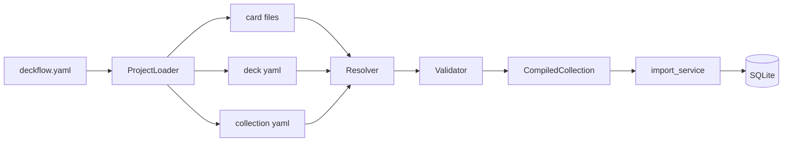

# Architecture

Deckflow is a local-first, data-centric spaced repetition system. Deck content is
defined in versioned **deck projects** (v2) or monolithic markdown files (v1/legacy);
SQLite stores scheduling state, review telemetry, and derived analytics.

## Layer overview

```
deck project / markdown
    → extract (v2 card files, v1/legacy adapters)
    → compiler (loader → resolver → validator)
    → CompiledCollection
    → import_service
    → repository (SQLite)
    → services (review, queue, analytics, stats, library)
    → cli / api (thin adapters)
    → web (React UI via FastAPI proxy)
```

## Core modules

| Layer | Path | Responsibility |
|-------|------|----------------|
| Schemas | `deckflow/schemas/` | Pydantic models for project specs and compiled output |
| Extract | `deckflow/extract/` | Format adapters: v2 card files, v1 markdown, legacy |
| Compiler | `deckflow/compiler/` | Load, resolve inheritance, validate, compile |
| Parser | `deckflow/parser/` | Backward-compat re-exports for v1/legacy parsing |
| Models | `deckflow/models/` | Dataclasses for DB rows and parsed input |
| DB | `deckflow/db/repository/` | Schema, migrations, SQL access (split by domain) |
| Scheduler | `deckflow/scheduler/` | FSRS wrapper for card scheduling |
| Services | `deckflow/service/` | Business logic — import, review, queue, analytics, library |
| CLI | `cli/` | Typer commands including validate, compile, migrate |
| API | `api/` | FastAPI REST endpoints for the web UI |
| Web | `web/` | React + Vite frontend |

## Compile pipeline (v2)



v1/legacy markdown files bypass the project loader and use `extract/markdown_v1.py`
to produce the same `CompiledCollection` shape.

## Data flow

### Import

1. `compile_path()` auto-detects project, collection dir, or markdown file.
2. `import_compiled()` upserts collections, decks, cards, and concepts.
3. `repository.upsert_card()` creates scheduling rows for new cards.

### Review

1. `queue_service.build_daily_queue()` scores due cards (optional `ReviewFocus` filter).
2. `review_service.get_next_card()` returns the top queued card.
3. On rating, FSRS updates scheduling; telemetry recorded; concept mastery refreshes.

### Learning Library

1. `library_service.get_learning_library()` builds deck module trie, concept topic tree, and track progress.
2. Deck paths roll up due/total counts at every `::` prefix.
3. Study tracks from collection `meta_json.tracks` expose current step focus for CLI/web.

### Analytics

- `concept_mastery` stores per-concept retention and weakness.
- `analytics_service` aggregates overview, weak spots, and per-card history.

## Extension points

| Change | Touch points |
|--------|--------------|
| New card field | `deckflow/schemas/specs.py` (CardSpec), `deckflow/extract/card_file.py`, import path |
| New validation rule | `deckflow/compiler/validator.py`, `schema.yaml` spec in docs |
| New analytics | `repository/analytics.py` + `analytics_service.py` + API + web |
| Schema change | `deckflow/db/schema.py`, `_migrate()` in `repository/base.py`, tests |

## Maintainability rules

- **Service layer only** for business logic; CLI and API stay thin.
- **No raw SQL outside** `deckflow/db/repository/`.
- **Schema changes** require migration + test.
- **Deck format changes** require Pydantic schema + docs + example + tests.
- **Semver:** `0.x` until stable; minor for features, patch for fixes.

## Repository package layout

| Module | Responsibility |
|--------|----------------|
| `base.py` | Connection, initialize, migrations |
| `collections.py` | Collection CRUD |
| `concepts.py` | Concepts and card-concept links |
| `cards.py` | Decks, cards, scheduling queries, focus filters |
| `reviews.py` | Sessions and review records |
| `analytics.py` | Mastery, stats, retention |
